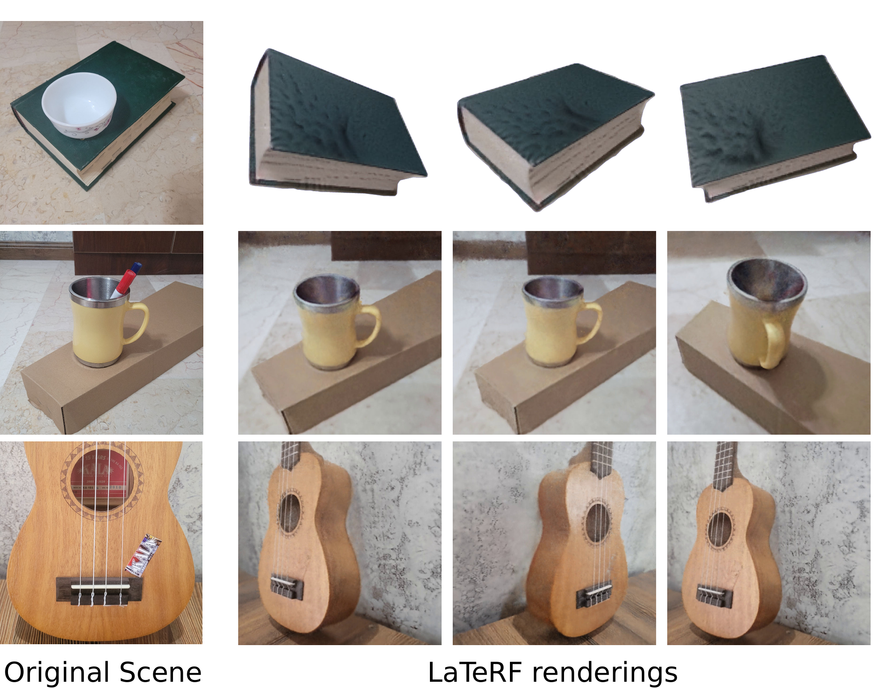

# LaTeRF: Label and Text Driven Object Radiance Fields [ECCV 2022]

### [Paper](https://arxiv.org/abs/2207.01583)

PyTorch implementation of [LaTeRF: Label and Text Driven Object Radiance Fields](https://arxiv.org/abs/2207.01583).

[Ashkan Mirzaei](),
[Yash Kant](),
[Jonathan Kelly](),
[Igor Gilitschenski]()<br>
University of Toronto

_____________________




### Clone the repository

First, navigate to a folder you wish to have the project at, and clone LaTeRF's project using the following command:

```
git clone git@github.com:ashmrz/LaTeRF.git
```

### Install the dependencies

Install the dependencies before you run the code using the following command:

```
pip install -r requirements.txt
```

Please note that you have to install the right version of [Pytorch](https://pytorch.org/) according to your cuda
version. In addition, you need to install [COLMAP](https://colmap.github.io/) if you want to train on your own data.

Our experiments are done with the following:

- torch==1.11.0+cu113
- An Nvidia 3090 Geforce RTX 3090 GPU

### Download example data

You can either download the sample scenes
from [here](https://drive.google.com/file/d/1mF748i8lBu3Kq0yTz3olz3Ath9ityHS8/view?usp=sharing) and put them
under `./data`, or use the following commands to download them:

```
cd data
gdown 1mF748i8lBu3Kq0yTz3olz3Ath9ityHS8
unzip data.zip
cd ..
```

### Train LaTeRF

To train LaTeRF on the sample scenes, use one of the following commands:

```
python DS_NeRF/run_nerf.py --config DS_NeRF/configs/clock.txt
python DS_NeRF/run_nerf.py --config DS_NeRF/configs/hotdog.txt 
```

--------------

During the training, a GUI panel is shown to let you modify some parameters during the training. These parameters
include the following:

- `Clf weight`: The weight of the classification loss.
- `CLIP weight`: The weight of the CLIP loss. The calculation of the CLIP loss is memory intensive; Thus, consider
  setting the `CLIP weight` to 0 in case you have memory issues, and want to bypass the inpainting part.
- `i_CLIP`: The CLIP loss is calculated every `i_CLIP` steps during the training to speed up the process. For debugging
  purposes, every `i_CLIP` steps, a sample rendering is saved to `./test_renders`.
- `CLIP text`: The text prompt used to gide the model.
- `i_video`: A video of the scene is rendered every `i_video` steps. The videos can be found at `/logs`.
- `render_factor`: While rendering whole images of the scene, they are downsized by this factor. In case of getting
  memory errors, try increasing `render_factor` or reducing `N_rand` (the batch size) in the corresponding config file
  in `./DS_NeRF/configs`.

#### Training on your own data

In order to train on your own data, firstly you have to obtain the camera poses with COLMAP. We suggest using the
instruction given by [NeRF-Supervision](https://github.com/yenchenlin/nerf-supervision-public). Then, make sure to put
your dataset in a folder under `/data` in the following format (this is assuming that for the training, we are setting
the hyperparameter `factor` to 4):

```
├── colmap_depth.npy
├── colmap_output.txt
├── database.db
├── images
│   ├── IMG_001.jpg
│   ├── IMG_002.jpg
│   └── ...
├── images_4
│   ├── IMG_001.jpg
│   ├── IMG_002.jpg
│   ├── ...
│   └── label
│       ├── IMG_001.png
│       ├── IMG_002.png
│       └── ...
├── poses_bounds.npy
└── sparse
    └── 0
```

In the above structure, the `factor` is 4, thus the images that are directly inside the directory `images_4` have to be
the original images that are downsized by a factor of 4. In addition, inside `images_4` there is a directory
called `images_4/label`; It contains the object masks, where are named the same as their corresponding training image.
The object masks don't have to be super accurate. You can collect these rough masks with any off-the-shelf tool. Note
that among the pixel values of these masks, `1` means corresponding to the object of interest, `0` means either
corresponding to the foreground or the background, and `-1` means no information is available for that pixel.

### Additional features available in this codebase

- The use of [Tinycudann](https://github.com/NVlabs/tiny-cuda-nn) for the main neural network as implemented
  in [torch-ngp](https://github.com/ashawkey/torch-ngp) for speedup.
- The use of [DS-NeRF](https://github.com/dunbar12138/DSNeRF) as implemented
  in [NeRF-Supervision](https://github.com/yenchenlin/nerf-supervision-public), which again speeds up the process by
  using the sparse depth priors from SFM.

## Citation

```
@misc{mirzaei2022laterf,
  title = {{LaTeRF}: Label and Text Driven Object Radiance Fields},
  author = {Mirzaei, Ashkan and Kant, Yash and Kelly, Jonathan and Gilitschenski, Igor},
  publisher = {arXiv},
  year = {2022},
}
```

